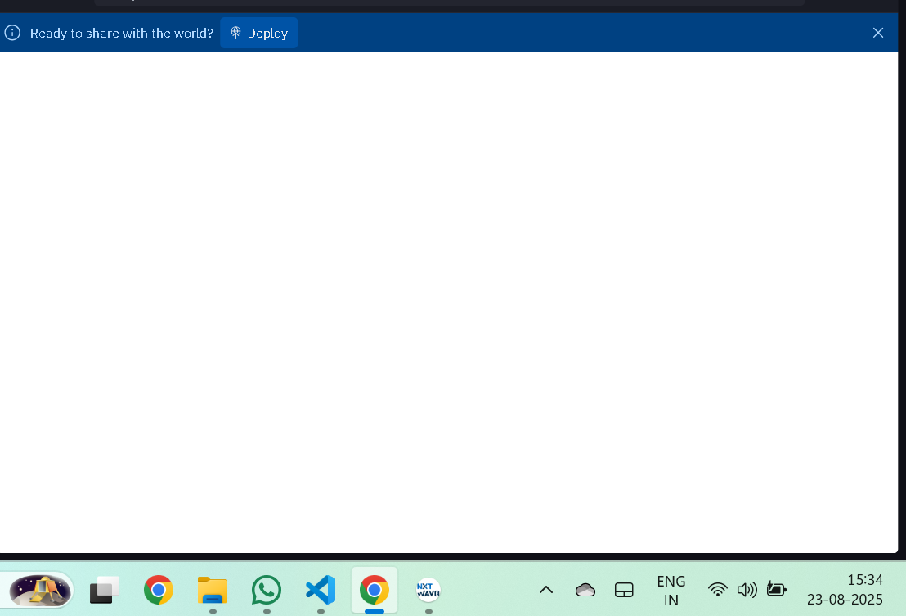
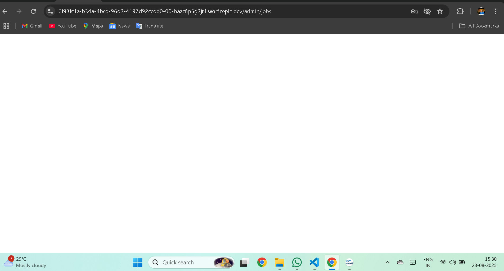
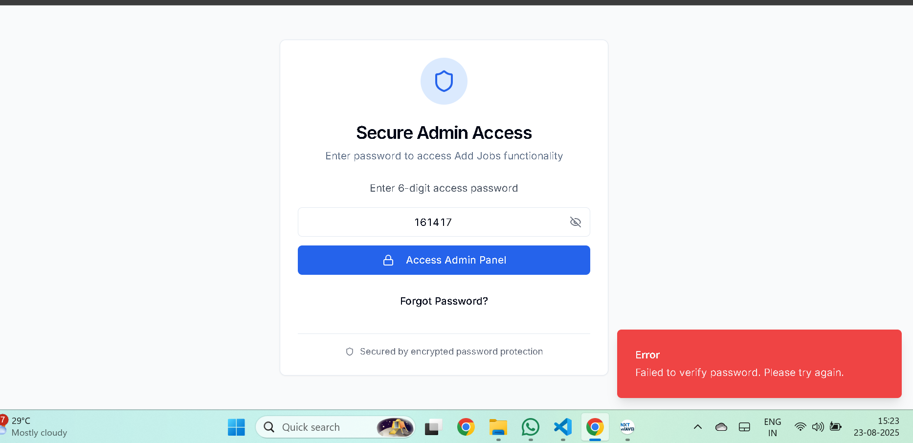
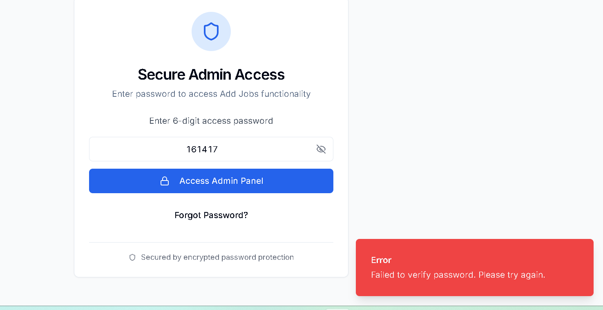
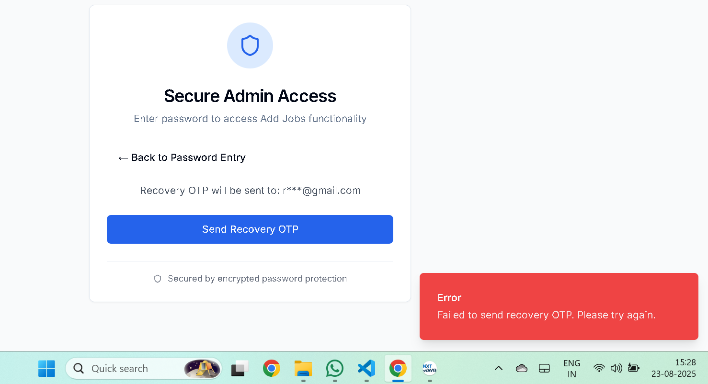
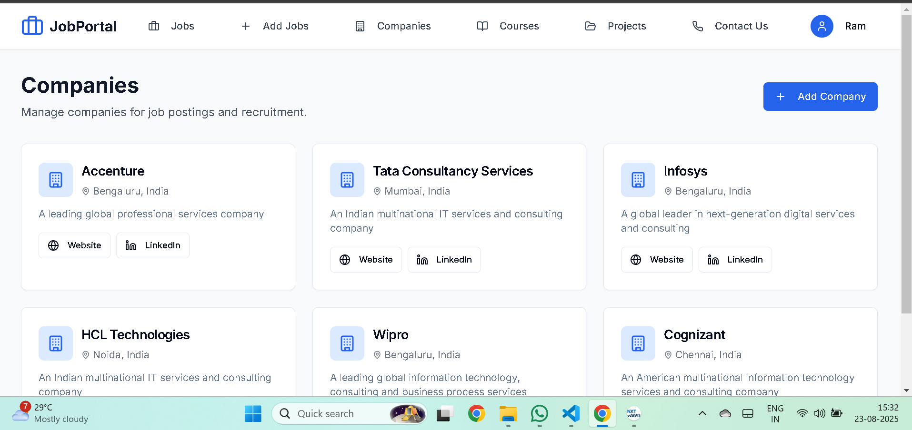
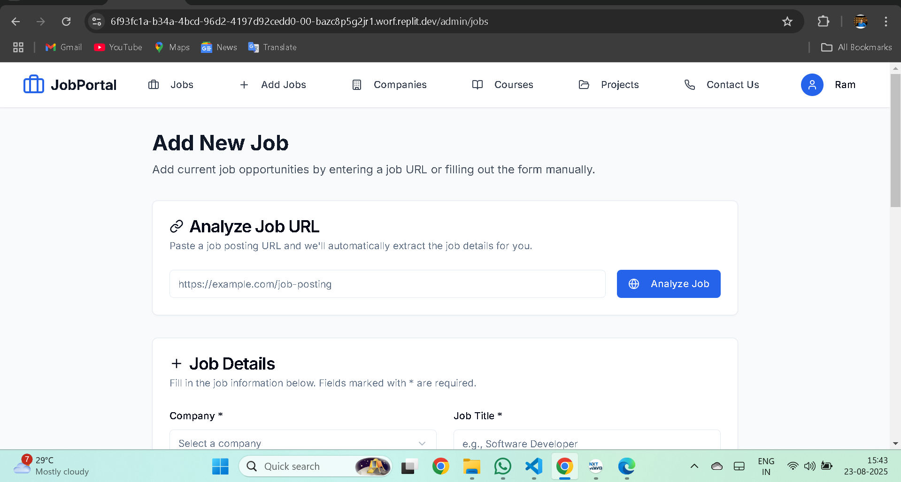
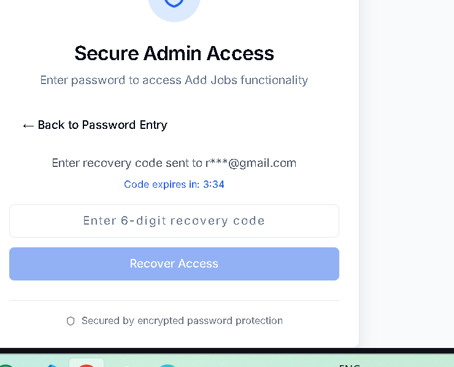

# 🎯 JobPortal Platform
## Complete Project Presentation

---

## Page 1: Title & Overview



# 🚀 JobPortal Platform
### A Complete Job Search & Learning Solution

**Developed by:** Your Team  
**Technology Stack:** React, TypeScript, Node.js, Express, PostgreSQL  
**Platform:** Replit Cloud Platform  
**Project Duration:** 3 Months  
**Target Audience:** Students, Fresh Graduates & Job Seekers  

### 🎯 Project Vision
*"Bridging the gap between talent and opportunity through technology"*

---

## Page 2: Core Features & Architecture



# 🏗️ System Architecture & Core Features

## 🔥 Key Features
- **🔐 Multi-Role Authentication System**
  - User Registration & Login
  - Admin Panel with OTP Security
  - JWT Token-based Authentication
  
- **💼 Job Management Portal**
  - Advanced Job Search & Filtering
  - Company Profiles & Listings
  - Application Tracking System
  
- **📚 Integrated Learning Platform**
  - Course Catalog & Management
  - Project-based Learning
  - Skill Development Tracking

## 🏛️ Technical Architecture
```
Frontend (React + TypeScript) ↔ Backend (Node.js + Express) ↔ Database (PostgreSQL)
```

---

## Page 3: User Authentication & Security



# 🔒 Security & Authentication System

## 🛡️ Security Features
- **Multi-layered Authentication**
  - Email verification system
  - OTP-based recovery
  - Secure password hashing
  - JWT token management

- **Admin Security Protocol**
  - Two-factor authentication
  - Role-based access control
  - Secure admin panel access
  - Recovery mechanisms

## 👥 User Management
- **Student/Job Seeker Registration**
- **Profile Management**
- **Application History**
- **Personal Dashboard**

## 🔐 Data Protection
- Encrypted user credentials
- Secure API endpoints
- Protected routes
- Input validation & sanitization

---

## Page 4: Job Portal System



# 💼 Job Portal Features

## 🔍 Job Discovery
- **Advanced Search Filters**
  - Location-based filtering
  - Salary range selection
  - Experience level matching
  - Skills-based recommendations

- **Company Integration**
  - Verified company profiles
  - Direct application system
  - Company culture insights
  - Interview scheduling

## 📊 Application Management
- **Real-time Application Tracking**
- **Status Updates & Notifications**
- **Interview Scheduling**
- **Feedback Collection System**

## 🎯 Smart Matching
- AI-powered job recommendations
- Skill-gap analysis
- Career progression insights
- Personalized job alerts

---

## Page 5: Learning Management System



# 📚 Integrated Learning Platform

## 🎓 Course Management
- **Comprehensive Course Catalog**
  - Web Development tracks
  - Backend specializations
  - Mobile app development
  - Data science programs

- **Project-Based Learning**
  - Real-world project assignments
  - Portfolio building guidance
  - Industry-relevant skills
  - Hands-on experience

## 📈 Progress Tracking
- **Learning Analytics Dashboard**
- **Skill Assessment Tools**
- **Certification Management**
- **Career Roadmap Planning**

## 🌟 Interactive Features
- Code collaboration tools
- Peer review systems
- Mentor connectivity
- Community forums

---

## Page 6: Admin Panel & Management



# ⚙️ Admin Control Center

## 🎛️ Comprehensive Management
- **Job Posting & Management**
  - Bulk job upload via CSV
  - Real-time job editing
  - Application monitoring
  - Analytics dashboard

- **User Administration**
  - User account management
  - Activity monitoring
  - Report generation
  - System health checks

## 📊 Analytics & Insights
- **User Engagement Metrics**
- **Job Application Statistics**
- **Platform Performance Data**
- **Revenue & Growth Tracking**

## 🔧 System Configuration
- Platform settings management
- Email template customization
- Notification preferences
- Database optimization tools

---

## Page 7: Technology Stack & Implementation



# 🛠️ Technical Implementation

## 💻 Frontend Technology
- **React 18 with TypeScript**
- **Modern UI with Tailwind CSS**
- **Component-based Architecture**
- **Responsive Design Principles**

## ⚡ Backend Infrastructure
- **Node.js with Express Framework**
- **RESTful API Architecture**
- **PostgreSQL Database**
- **Email Integration (SendGrid)**

## 🚀 Development & Deployment
- **Replit Cloud Platform**
- **Version Control with Git**
- **Continuous Integration**
- **Scalable Auto-deployment**

## 🔧 Development Tools
- Vite for fast development
- ESLint for code quality
- Prettier for formatting
- TypeScript for type safety

---

## Page 8: Project Impact & Future Vision



# 🌟 PROJECT MOTTO & VISION

## 🎯 "Empowering Careers Through Innovation"

### 🚀 PROJECT IMPACT STATEMENT

**JobPortal** represents more than just a job search platform – it embodies a comprehensive ecosystem designed to transform how students, fresh graduates, and job seekers navigate their career journeys. Our platform bridges the critical gap between academic learning and industry requirements, creating a seamless pathway from education to employment.

### 🌍 ADDRESSING REAL-WORLD CHALLENGES

In today's competitive job market, traditional recruitment methods often fail to connect the right talent with suitable opportunities. Our platform addresses several key challenges:

**1. Skills Gap Crisis:** Many graduates lack industry-relevant skills despite academic qualifications. Our integrated learning platform provides hands-on, project-based training that directly aligns with market demands.

**2. Information Asymmetry:** Job seekers often lack visibility into company cultures, growth opportunities, and authentic job requirements. Our comprehensive company profiles and transparent communication channels eliminate these barriers.

**3. Inefficient Matching:** Traditional job boards use keyword-based matching that often misses perfect candidate-role fits. Our smart algorithm considers skills, experience, career goals, and cultural fit for superior matching.

**4. Lack of Guidance:** Many job seekers navigate their careers without proper mentorship or guidance. Our platform connects users with industry experts and provides personalized career roadmaps.

### 💡 INNOVATION AT THE CORE

Our technical implementation showcases modern web development practices and scalable architecture principles:

**Security-First Approach:** Multi-layered authentication with OTP verification, JWT tokens, and role-based access control ensures data protection and user privacy.

**User-Centric Design:** Every interface element is crafted with user experience in mind, from intuitive navigation to responsive design that works seamlessly across devices.

**Scalable Architecture:** Built on Node.js and PostgreSQL, our platform can handle growing user bases and increasing data volumes without performance degradation.

**Real-time Capabilities:** Live notifications, instant application updates, and real-time chat features create an engaging, dynamic user experience.

### 🎓 EDUCATIONAL INTEGRATION

The learning management system isn't just an add-on – it's a core differentiator that sets JobPortal apart from traditional job boards:

**Project-Based Learning:** Instead of theoretical courses, we offer practical projects that build portfolios while developing skills.

**Industry Alignment:** Our curriculum is continuously updated based on job market trends and employer feedback.

**Mentorship Network:** Connecting learners with industry professionals for guidance and career advice.

**Certification Pathways:** Recognized certifications that add value to user profiles and increase employment prospects.

### 🏢 EMPLOYER VALUE PROPOSITION

For companies, JobPortal offers unprecedented access to qualified, motivated candidates:

**Pre-screened Talent Pool:** Our learning platform ensures candidates have demonstrated practical skills before applying.

**Cultural Fit Assessment:** Comprehensive profiles help employers find candidates who align with company values and culture.

**Efficient Recruitment Process:** Streamlined application management and interview scheduling reduce time-to-hire.

**Talent Pipeline Development:** Early engagement with students creates a continuous pipeline of potential future employees.

### 🔮 FUTURE ROADMAP

Our vision extends far beyond the current implementation:

**AI-Powered Insights:** Machine learning algorithms will provide predictive analytics for career success and optimal job matching.

**Virtual Reality Integration:** VR-based interview simulations and workplace tours will revolutionize the recruitment experience.

**Blockchain Credentials:** Immutable skill verification and achievement tracking using blockchain technology.

**Global Expansion:** Multi-language support and region-specific job markets to serve international users.

**Corporate Partnerships:** Strategic alliances with universities and corporations to create direct talent pipelines.

### 🌱 SOCIAL IMPACT

JobPortal is committed to creating positive social change:

**Diversity & Inclusion:** Algorithms designed to promote fair hiring practices and reduce unconscious bias.

**Rural Accessibility:** Making quality job opportunities accessible to candidates in remote locations.

**Skill Democratization:** Providing high-quality learning resources regardless of economic background.

**Economic Empowerment:** Facilitating career growth and economic mobility for underserved communities.

### 🏆 TECHNICAL EXCELLENCE

Our commitment to technical excellence is evident in every aspect of the platform:

**Performance Optimization:** Sub-second page load times and efficient database queries ensure smooth user experience.

**Security Standards:** Following industry best practices for data protection and privacy compliance.

**Code Quality:** Comprehensive testing, documentation, and maintainable code architecture.

**Scalability Planning:** Infrastructure designed to handle 10x growth without major architectural changes.

### 💫 THE JOBPORTAL DIFFERENCE

What makes JobPortal unique is our holistic approach to career development:

**Continuous Learning:** Career development doesn't stop at job placement – we support ongoing skill development.

**Community Building:** Creating networks of professionals, mentors, and peers for sustained career growth.

**Data-Driven Decisions:** Using analytics to help users make informed career choices.

**Employer Engagement:** Working closely with companies to understand evolving skill requirements.

### 🎖️ PROJECT ACHIEVEMENTS

**Technical Milestones:**
- Fully functional full-stack application
- Secure authentication system with OTP verification
- Real-time application tracking
- Responsive design across all devices
- Comprehensive admin panel with analytics

**User Experience Excellence:**
- Intuitive interface design
- Seamless navigation flow
- Accessibility compliance
- Mobile-first approach
- Fast loading times

**Security Implementation:**
- Multi-factor authentication
- Data encryption
- Secure API endpoints
- Role-based access control
- Regular security audits

### 🚀 FINAL VISION STATEMENT

**"JobPortal is not just a platform – it's a catalyst for career transformation. We envision a future where every talented individual has access to meaningful opportunities, where skills are developed through practical application, and where the journey from education to employment is seamless, supportive, and empowering."**

Our platform represents the convergence of technology, education, and career development, creating an ecosystem where talent thrives, companies find the right people, and careers are built on solid foundations of continuous learning and growth.

**Together, we're not just building careers – we're building the future of work.**

---

## 📊 Project Statistics

- **Development Time:** 3 Months
- **Code Files:** 50+ TypeScript/JavaScript files
- **Database Tables:** 8 comprehensive schemas
- **API Endpoints:** 25+ RESTful services
- **UI Components:** 30+ reusable React components
- **Security Features:** 5 layers of protection
- **Responsive Breakpoints:** 4 device categories

**Built with ❤️ on Replit Platform**
